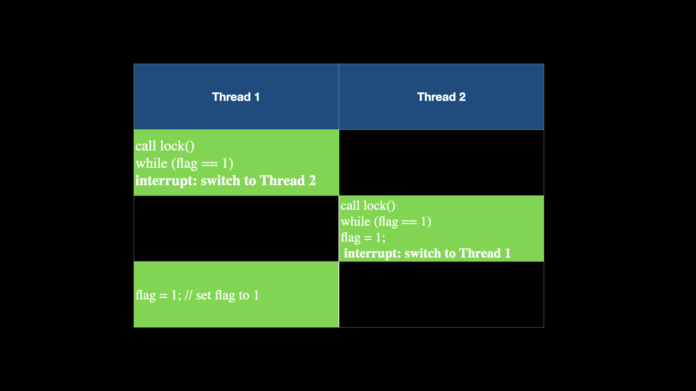

# My Notes and work of *Operating System: Three easy pieces*

## Chapter 4
**Process**: The abstraction provided by the OS of a running program.

Process API:
what must be included in any interface of an operating system: create, destroy, wait, iscellaneous control, and status.

## Chapter 5
[fcfs_test.c]

FCFS Algorithm:  
First come first serve  
The average waiting time under an FCFS policy is generally not minimal and may vary substantially if the process's CPU burst time vary greatly  
FCFS scheduling algorithm is not nonpreemepive

*burst time*: also referred to as "execution time", is the amound of CPU time the process requires to complete its execution.

*preemptive*: a process can be placed back in the ready queue if that process still has CPU burst time remaining.

*non-preemptive:* once the resources (CPU cycles) are allocated to a process, the process holds the CPU till it gets terminated or reaches a waiting state.

*turnaround time*: The amount of time taken to complete a process or fulfill a request.

## 5_chapter
Limited direct execution: just run the program directly on the CPU. When the OS wishes to start a program running, it creates a process entry for it in a process list, allocates some memory for it, loads the program code into memory (from disk).

But this approach gives rise to a few problems: 1. How can system run efficiently when program exception occurs; 2. How can system stop a process from running and switch to another, then go back to run the process?
1. The first problem: how os deals with program exceptions?
- introduce a new process mode
**user mode**: code that runs in user mode is restricted in what it can do.

**kernel mode**: the operating system (or kernel) runs in.
- what should a user program do when it wishes to perform some kind of privileged operation?
Perform system call: system calls allow the kernel to carefully expose certain key pieces of functionality to user programs.

**How to execute a system call?** a program must execute a special *trap* instruction. This instruction simultaneously jumps into the kernel and raises the privilege level to kernel mode; once in kernel, hte system can now perform whatever privileged operations are needed(if allowed), and thus do the required work for the calling process. When finished, the OS calls a special *return-from-trap* instruction, which, as you might expect, returns into the calling suer program while simultaneously reducing the privilege level back to user mode.

(tips) when executing a trap, the ahrdware needs to be a bit careful. more detail on intel systems manuals. see book page 52.

There is one important thing left behind:
**How does the trap know which code to run inside the OS?** the calling process can't specify an address to jump to; doing so would allow programs to jump anywhere inside a kernel. So the kernel must carefully know what codes executes upon a trap. (know trap refers to what code)

The kernel does so by setting up a trap table at boot time. （电脑启动时间）. thus is free to configure machine hardware as need be. When the machine boots up, it does so in privileged (kernel) mode,, and thus is free to configure machien hardware as need be. Once the hardware is informed, it remembers the location of these handlers until the machine is next rebooted, and thus the hardware knows what to do (like keyboard interruption occurs, the hardware knows what code to jump to, *trap handler*) when system calls and other exceptional events take place.

*system-call numebr:* specify the exact system call. assigned to each system call. The user code is thus responsible for placing the desired system-call numebr in a register or at a specified location on the stack; the OS examines these numbers and ensures it's valid. *protection*: user code cannot specify an exact address to jump to, but rather must request a particular service via number.

We assume each process has a kernel stack where registers (including general purpose registers and the program counter) are saved to and restored form when transitioning into and out of the kernel.

**Switch between processes**
- how can OS regain control of teh CPU so that it can switch between processes.
Two approaches:
1. cooperative approach: wait for system calls
the OS trusts the processes of teh system to behave reasonably. processes that run for too long are assumed to periodically give up the CPU so that the OS can decide to run some other task. Most processes transfer control of teh CPU to the OS quite frequently by making system calls(to open a file and subsequently read it). system like this oftern include an explicit yield system call.
- A Non-Cooperative Approach: The OS takes control


## Chapter 15
Hardware support for memory reallocation:
1. require two different CPU modes, OS->privileged mode, the applications run in user mode
2. The hardware must provide base and bounds registers themselves, each CPU thus has an additional pair of registers, patt of the memory management unit of the CPU.
3. the hardware should provide special instructions to modify the base and bounds registers, allowing OS to change them when different processes run.
4. the CPU must be able to handle exceptions
Operating System Issues:
1. the OS must take action when a process is created, finding space for its address space in memory
2. the OS must do some work when a process is terminated. puts the memory back on the freelist.
3. perform a few additional steps when a context switch occurs
4. provide exceptional handles
  
**page table:** in a virtual memory system, a page table is a data structure used by the operating system to store the mapping between virtual address and physical addresses.

## chapter 17: free-space management
explore three questions:
- how should variable-size requests be maaged?
- how can we reduce fragmentation?
- what are hte time and space overheads of different approaches?


## chapter 18: page introduction
the operating system takes one of two approaches when solving most any space-management problem. The first approach is to chop things up into variable-sized pieces, as we saw with segmentation in virtual memory. But, this method divides a space into different-size chunks, the space can become fragmented.

It may be worth considering the second approach: to chop up space into fixed-sized pieces. we call this idea **paging**. Instead of spliting up a process's address space into some number of variable-sized logical segments, we divide it into fixed-sized units, each of which we call a page. We view physical memory as an array of fixed-sized slots called **page frames**.

Paging has a number of advantages over our previous approaches.  
one of the most important improvement will be flexibility: with a fully-developed paging approach, the system will be able to support the abstraction of an address space effectively, regardless of how a process uses the address space; we won't, for example, make assumptions about the direction the heap and stack grow and how they are used.  
Another advantages is the simplicity of free-space management that paging affords. For example, when the OS wishes to place our tiny 64-byte address space into our eight-page physical memory, it simply finds four free pages; perhaps the OS keeps the free-list of all free pages for this, and just grabs the first four free pages of of this list.

**how to record where each virtual pages of the address space is placed in physical memory?** OS keeps a per-process data structure called page table. The major role of the page table is to store address translations for each of the virtual pages of the address space.

translate the virtual address that the process generated: 
1. split the virtual address into two components: the virtual page number (VPN), and the offset within the page.
2. TO calculate VPN & offset: lower(log2(total page number))=VPN bits(the higher), offset=remaining bits (lower)

physical frame number (PFN): an address in physical memory. it corresponds to a virtual page number by page table.

**Address space**: an address space is a set of discrete addresses that identifies a range of memory locations.

**page table base register(PTBR)**

The process of accessing memory with paging
```C
// Extract the VPN from the virtual address
VPN = (VirtualAddress & VPN_MASK) >> SHIFT
// Form the address of the page-table entry (PTE)
PTEAddr = PTBR + (VPN * sizeof(PTE))
// Fetch the PTE
PTE = AccessMemory(PTEAddr)
// Check if process can access the page
if (PTE.Valid == False)
    RaiseException(SEGMENTATION_FAULT)
else if (CanAccess(PTE.ProtectBits) == False)
    RaiseException(PROTECTION_FAULT)
else
    // Access is OK: form physical address and fetch it
offset = VirtualAddress & OFFSET_MASK
PhysAddr = (PTE.PFN << PFN_SHIFT) | offset
Register = AccessMemory(PhysAddr)
```

## Chapter 19: Paging: faster translation(TLB: translation-lookaside buffer)
a TLB is part of chip's memory management unit, and is simply a hardware cache of popular virtual to physical address translation thus a better name would be an address-translation cache.

**page directory**: either can be used to tell you 
1. where a page of teh page table is, Or that
2. the entire page of the page table contains no valid pages.

**page directory entries(PDE)**: a PDE has a valid bit and a **page frame number(PFN)**.

## chapter 21: beyond physical memory: mechanisms

the page fault: if a page is not present, the OS in put in chatge to handle the page fault. The appropriately-named OS *page-fault handler* runs to determine what to do.  
If a page is not present and has been swapped to disk, the OS will need to swap teh page into memory in order to service the page fault.  
*How will the OS know where where to find hte desired page?* page table stores such information. 
1. The OS could use the bits in the PTE normally used for data such as the PFN of teh page for a disk address. When the OS receives a page fault for a page, ti looks in the PTE to find teh address, and issue the request to disk to fetch the page into memory.
2. When the disk I/O completes, the OS will then update the page table to mark the page as present, update the PFN field of teh page-table entry(PTE) to record the in-memory location of the newly-fetched page, and retry the instruction.
3. a last restart would find the translation from memory at the translated physical address.

If the page is full: *page replacement policy*

**classification**: page present vs page valid
a page is considered "present" if it currently resides in physical memory(RAM).
if a page is not present, a page fault occurs, and the operating system needs to fetch the required page from swap space (launches PAGE_FAULT exception to the OS)

page valid: This term is not as standard and can be context-dependent. It might refer to whether a page is valid in the context of a specific operation or a particular criteria. famous example: segmentation fault

the present-bit in the page-table entry informs the operating system that a page exists in physical memory.

**Page Fault Control Flow(Hardware Version)**
```C
VPN = (VirtualAddress & VPN_MASK) >> SHIFT
(Success, TlbEntry) = TLB_Lookup(VPN)
if(Success == True)
    Offset = VirtualAddress & Offset_Mask
    PhysAddr = (TlbEntry.PFN << SHIFT) | offset
    Register = AccessMemory(PhysicalAddress)
else
    // TLB Miss
    PTEAddress = PTBR + (VPN * sizeof(PTE)) // I don't know why PTEAddress still use array at this point
    PTE = AccessMemory(PTEAddress)
    if (PTE.Valid == False)
        RaiseException(SECMENTATION_FAULT)
    else
        if(PTE.Present == False) // page fault, but still valid
            RaiseException(PAGE_FAULT)
        else
            TLB_Insert(VPN, PTE.PFN)
            RetryInstruction()
```
**page-fault control flow algorithm (software version)**
```C

```
TO keep a small amount of memory free, most operating systems thus have some kind of hign watermark(HW) and low watermark(LW) to help decide when to start evicting pages from memory.

## Chapter 28: Locks  
lock variable
```C
lock_t mutex; // some globally-allocated lock ’mutex’
 ...
lock(&mutex);
balance = balance + 1;
unlock(&mutex);
```
A lock is just a variable, and thus to use one, you must declare a lock variable of some kind. This lock variable holds the state of the lock *at any instant in time*. It is either available (or unlocked or free) and thus no thread holds the lock, or __acquired__ (or locked or held), and thus exactly one thread holds the lock and presumably is in a critical section.

__Evaluate Locks__:  
1. whether the lock does its basic task, which is to provide *mutual exclusion*.
2. fairness: Does each thread contending for the lock get a fair shot at acquiring it once it is free? More extreme case: Does any thread contending for the lock starve while doing so, thus never obtaining it?  
- Concept understanding: __starve__. "starvation" refers to a situation where a thread or process is unable to make progress because it is consistently denied access to a particular resource, such as a lock. When a thread is starved, it remains blocked or delayed, waiting for a resource that is never made available to it.
3. performance, specifically the time overheads added by using the lock.
There are a few different cases that are worth considering here:
- no contention: when a single thread is running and grabs and releases the lock, what is the overhead of doing so?
- multiple threads are contending for the lock on a single CPU
- How does the lock perform when there are multiple CPUs involved, and threads on each contending for the lock?

### Controlling Interrupts  
disable interrupts for critical sections. This solution was invented for single-processor systems.
```C
void lock() {
    DisableInterrupts();
}
void unlock() {
    EnableInterrupts();
}
```
Pro:  
1. simplicity
Con:
1. this approach requires us to allow any calling thread to perform a privileged operation(turning interrupts on and off), and thus trust that this facility is not abused.
    - here, the trouble manifests in many of ways: 
    - a greedy program could call lock() at the beginning of its execution and thus monopolize the processor; _monopolize_: obtain exclusive possession
    - an errant or malicious program could call lock and go into an endless loop.
2. This approach does not work on multiprocessors. Threads will be able to run on other processors, and thus could enter the critical section.
3. turning off interrupts for extended periods of time can lead to interrupts becoming lost, which can lead to serious systems problems.
4. this approach can be inefficient.
Turning off interrupts is only used in limited contexts.(like OS itself will use interrup masking to guarantee atomicity when accessing its own data structures.)

### first attempt: just using loads/stores

```C
typedef struct __lock_t { int flag; } lock_t;

void init(lock_t *mutex) {
    // 0 -> lock is available, 1 -> held
     mutex->flag = 0;
}

 void lock(lock_t *mutex) {
    while (mutex->flag == 1) // TEST the flag
    ; // spin-wait (do nothing)
    mutex->flag = 1; // now SET it!
 }

 void unlock(lock_t *mutex) {
    mutex->flag = 0;
 }
```

*spin-wait*: wait in a loop  
The code has two problems:
1. correctness: with timely interrupts, we can easily produce a case where both threads set the flag to 1 and both threads are thus able to enter the critical section.

2. performance: a thread endlessly checks the value of flag. Spin-waiting wastes time waiting for another thread to release a lock. The thread that the waiter is waiting for cannot run until a context switch occurs.


### test-and-set+spin_waiting
Why it looks so strange?
```C
int TestAndSet(int *old_ptr, int new){
    int old = *old_ptr; // fetch old value at old_ptr
    *old_ptr = new; // store ’new’ into old_ptr
    return old;
}
```

```C
int TestAndSet(int *old_ptr, int new){
    int old = *old_ptr; // fetch old value at old_ptr
    *old_ptr = new; // store
    return old; // return the old value
}
```

```C
int TestAndSet(int *old_ptr, int new){
    int old = *old_ptr; // fetch old value at old_ptr
    *old_ptr = new; 
    return old;
}
```


```C
typedef struct __lock_t {
 int flag;
 } lock_t;

 void init(lock_t *lock) {
 // 0: lock is available, 1: lock is held
 lock->flag = 0;
 }

 void lock(lock_t *lock) {
 while (TestAndSet(&lock->flag, 1) == 1)
 ; // spin-wait (do nothing)
 }

 void unlock(lock_t *lock) {
 lock->flag = 0;
 }
 ```

As long as the lock is held by another thread, `TestAndSet()` will repeatedly return a 1.

Personally, the greatest improvement of this code with the false code is that this code change `lock->flag` before `while` loop determination. However the false code (use flag == true to determine the lock) change the value `"after"` the while loop determining part.

### Evaluate spin locks
use the three criteria to evaluate spin locks:
1. correctness: it provide mutual exclusion
2. fairness: no. a thread spinning may spin forever under contention. simple spin locks(as discussed thus far) are not fair and may lead to sty specific starvation.  
- Because spin locks do not guarantee any specific order for granting access to waiting threads, there is a potential for starvation. A thread might continuously be outrun by other threads arriving later, preventing it from acquiring the lock and entering the critical section.
3. performance: 
two cases:
- single CPU: performance overhead can be quite painful. Consider the case where the thread holding the lock gets preempted within a critical section. The scheduler may then run every other thread (imagine there are N-1 others), with each trying to acquire the lock. In this situation, each thread will spin for a time slice before releasing the CPU, wasting CPU cycles.
- multiple CPUs: spin locks work reasonably well. critical section is short. when thread A runs, B will spin on another CPU. since critical section is short, B doesn't need to wait for a long time in spinning.

### Compare and Swap
```C
 int CompareAndSwap(int *ptr, int expected, int new) {
    int original = *ptr;
    if (original == expected)
       *ptr = new;
       return original;
 }
```
```C
 void lock(lock_t *lock) {
 while (CompareAndSwap(&lock->flag, 0, 1) == 1)
    ; // spin
 }
```

### Load-Linked and Store-Conditional
```C
int LoadLinked(int *ptr) {
    return *ptr;
 }

 int StoreConditional(int *ptr, int value) {
    if (no update to *ptr since LoadLinked to this address) {
    *ptr = value;
    return 1; // success!
    } else {
    return 0; // failed to update
    }
 }
```

```C
void lock(lock_t *lock) {
 while (1) {
 while (LoadLinked(&lock->flag) == 1)
 ; // spin until it’s zero
 if (StoreConditional(&lock->flag, 1) == 1)
 return; // if set-it-to-1 was a success: all done
 // otherwise: try it all over again
 }
 }

 void unlock(lock_t *lock) {
 lock->flag = 0;
 }
```